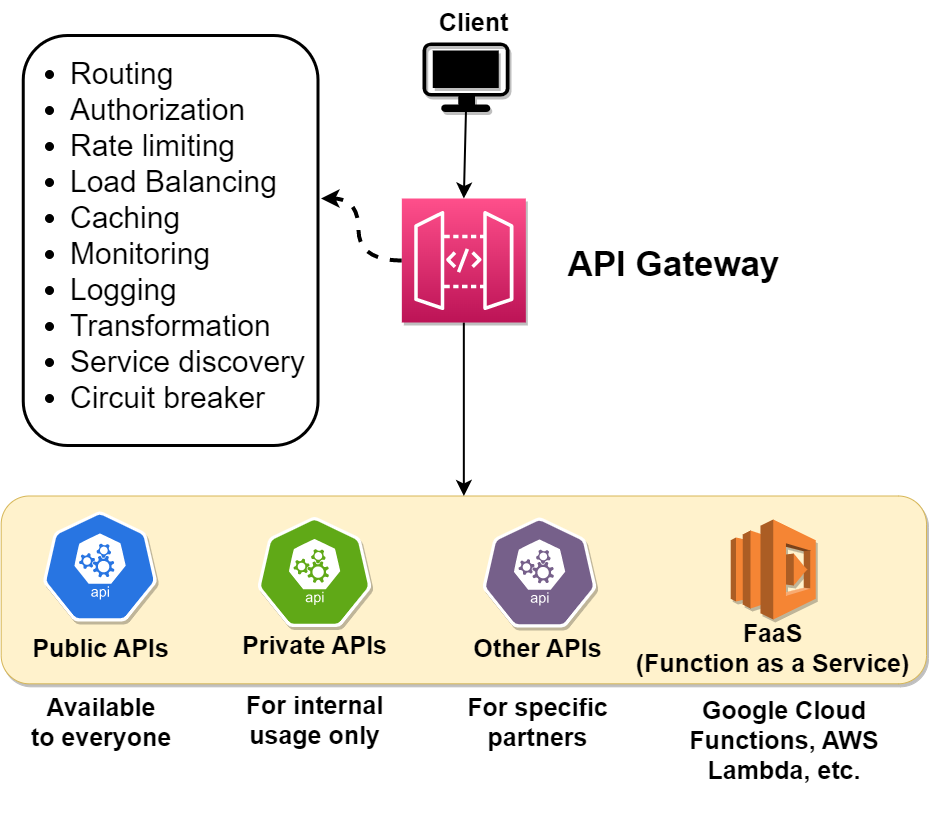
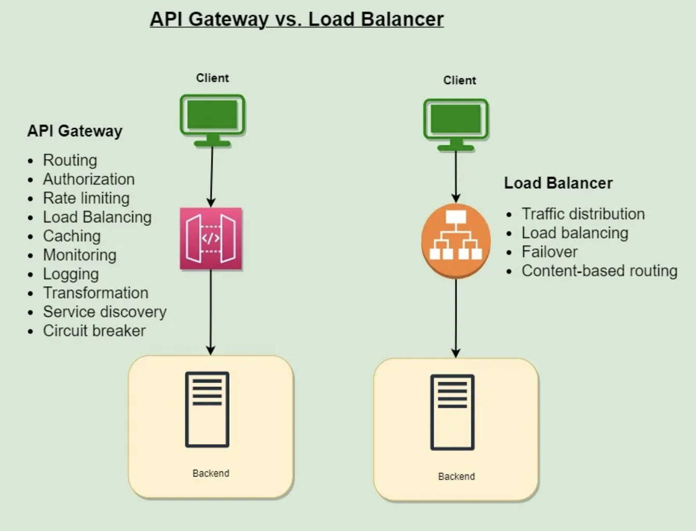

- [API Gateway](#api-gateway)
  - [API Gateway vs Load Balancers](#api-gateway-vs-load-balancers)
  - [API Gateway Usage](#api-gateway-usage)
  - [API Gateway Advantages](#api-gateway-advantages)
  - [API Gateway Disadvantages](#api-gateway-disadvantages)

# API Gateway

An API Gateway is a server or service that acts as an intermediary between external clients and the internal microservices or API-based backend services of an application. It is a crucial component in modern architectures, especially in microservices-based systems, where it simplifies the communication process and provides a single entry point for clients to access various services.

## API Gateway vs Load Balancers

An API gateway is focused on 𝗿𝗼𝘂𝘁𝗶𝗻𝗴 requests to the appropriate microservice, while a load balancer is focused on 𝗱𝗶𝘀𝘁𝗿𝗶𝗯𝘂𝘁𝗶𝗻𝗴 requests evenly across a group of backend servers.

An API gateway and a load balancer are both types of infrastructure that can be used in a computer network to manage incoming requests and enhance the performance of a system. However, they work in different ways and serve different purposes.

An API gateway is a type of middleware that sits between a client and a collection of microservices. Its main purpose is to route requests from clients to the appropriate microservice and then to return the response from the microservice back to the client. An API gateway can also perform other tasks such as authorization, rate limiting, and caching.

A load balancer, on the other hand, is a type of infrastructure that distributes incoming requests evenly across a group of backend servers in order to improve the performance and availability of a system. Load balancers are typically used to handle requests that are sent to a single, well-known IP address, and then route them to one of many possible backend servers based on factors such as server performance and availability.

Another difference between the two is the type of requests that they typically handle. An API gateway is typically used to handle requests for APIs, which are web-based interfaces that allow applications to interact with each other over the internet. These requests typically have a **specific URL that identifies the API** that the client is trying to access, and the API gateway routes the request to the appropriate microservice based on this URL. A load balancer, on the other hand, is typically used to handle requests that are sent to a **single, well-known IP address**, and then routes them to one of many possible backend servers based on factors such as server performance and availability.

## API Gateway Usage

API gateways are used for a variety of purposes in microservice architectures, including the following:

1. **Routing**: The API gateway receives requests from clients and routes them to the appropriate microservice. This enables clients to access the various microservices through a single entry point, simplifying the overall system design.
2. **Rate limiting**: You can rate limit client access to microservices with an API gateway. This can help prevent denial of service attacks and other types of malicious behavior.
3. **Caching**: The API gateway can cache responses from the microservices, reducing the number of requests that need to be forwarded to the microservices and improving the overall performance of the system.
4. **Authentication and Authorization**: The API gateway can be used to authenticate clients and enforce access control policies for the microservices. This helps to ensure that only authorized clients can access the microservices and helps to prevent unauthorized access.
5. **Load balancing**: The API gateway can distribute incoming requests among multiple instances of a microservice, enabling the system to handle a larger number of requests and improving its overall performance and scalability.
6. **Monitoring**: The API gateway can collect metrics and other data about requests and responses, providing valuable insights into the performance and behavior of the microservices. This can help to identify and diagnose problems, and improve the overall reliability and resilience of the system.
7. **Transformation**: The API gateway can be used to transform the data received from the microservices into a format that is more convenient for the clients to use. This can include tasks such as converting between different data formats, such as XML and JSON, or aggregating data from multiple microservices into a single response.
8. **Request and response validation**: The API gateway can be used to validate the requests and responses from the microservices to ensure that they conform to the expected format and structure. This can help to prevent errors and ensure that the microservices are functioning properly.
9. **Circuit breaker**: The API gateway can be used to implement a circuit breaker pattern, which can help to prevent a single failed microservice from bringing down the entire system. The circuit breaker can monitor the health of the microservices and automatically fail over to a backup service if necessary.
10. **Service discovery**: The API gateway can be used to discover the available microservices and their locations, enabling the clients to access them without knowing their specific addresses. This can make it easier to add new microservices or make changes to the existing ones without impacting the clients.

## API Gateway Advantages

Here are some of the advantages of using API Gateway:

1. **Improved performance**: By handling tasks such as routing and load balancing, the API gateway can improve the overall performance of the system, enabling it to handle a larger number of requests and respond more quickly to the clients.
2. **Simplified system design**: By providing a single entry point for the clients, the API gateway simplifies the overall system design and makes it easier for the clients to access the various microservices.
3. **Enhanced security**: The API gateway can be used to enforce authentication and access control policies, helping to prevent unauthorized access and improve the security of the system.
4. **Improved scalability**: The API gateway can distribute incoming requests among multiple instances of a microservice, enabling the system to scale more easily and handle a larger number of requests.
5. **Better monitoring and visibility**: The API gateway can collect metrics and other data about the requests and responses, providing valuable insights into the performance and behavior of the system. This can help to identify and diagnose problems, and improve the overall reliability and resilience of the system.

## API Gateway Disadvantages

There are also some potential disadvantages to using an API gateway, including:

1. **Increased complexity**: The use of an API gateway can add an extra layer of complexity to the system, which can make it more difficult to manage and maintain.
2. **Performance overhead**: The API gateway can introduce some performance overhead, as it adds an additional layer to the request-response path that the clients must traverse.
3. **Single point of failure**: The API gateway can become a single point of failure if it is not designed and implemented properly. This can impact the overall reliability and availability of the system.