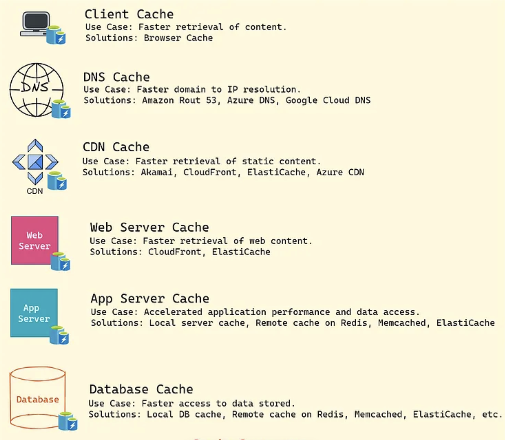

- [Caching](#caching)

# Caching

The cache is a high-speed storage layer that sits between the application and the original source of the data, such as a database, a file system, or a remote web service. 

When data is requested by the application, it is first checked in the cache. If the data is found in the cache, it is returned to the application. If the data is not found in the cache, it is retrieved from its original source, stored in the cache for future use, and returned to the application. 

In a distributed system, caching can be done at multiple places for example, Client, DNS, CDN, Load Balancer, API Gateway, Server, Database, etc.

