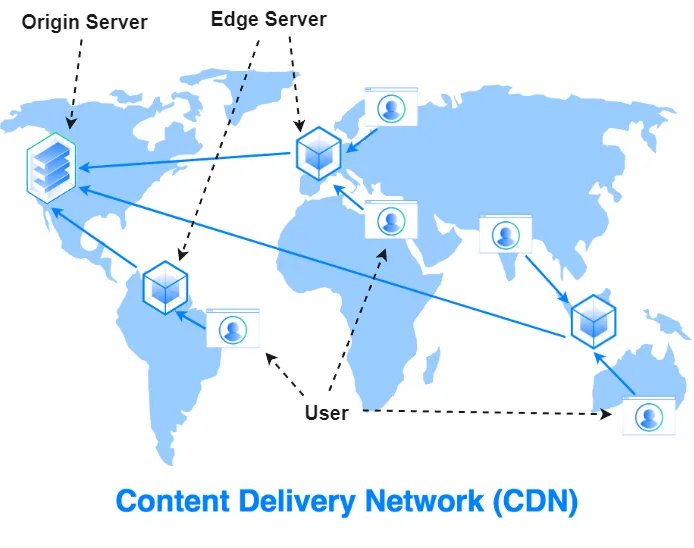

- [Content Delivery Network (CDN)](#content-delivery-network-cdn)

# Content Delivery Network (CDN)

A Content Delivery Network (CDN) is a distributed network of servers that store and deliver content, such as images, videos, stylesheets, and scripts, to users from geographically closer locations. CDNs are designed to improve the performance, speed, and reliability of content delivery to end-users, regardless of their location relative to the origin server.

Here’s how a CDN works:

1. When a user requests content from a website or application, the request is directed to the nearest CDN server, also known as an edge server.
2. If the edge server has the requested content cached, it directly serves the content to the user. This reduces latency and improves the user experience, as the content travels a shorter distance.
3. If the content is not cached on the edge server, the CDN retrieves it from the origin server or another nearby CDN server. Once the content is fetched, it is cached on the edge server and served to the user.
4. To ensure the content remains up-to-date, the CDN periodically checks the origin server for changes and updates its cache accordingly.

