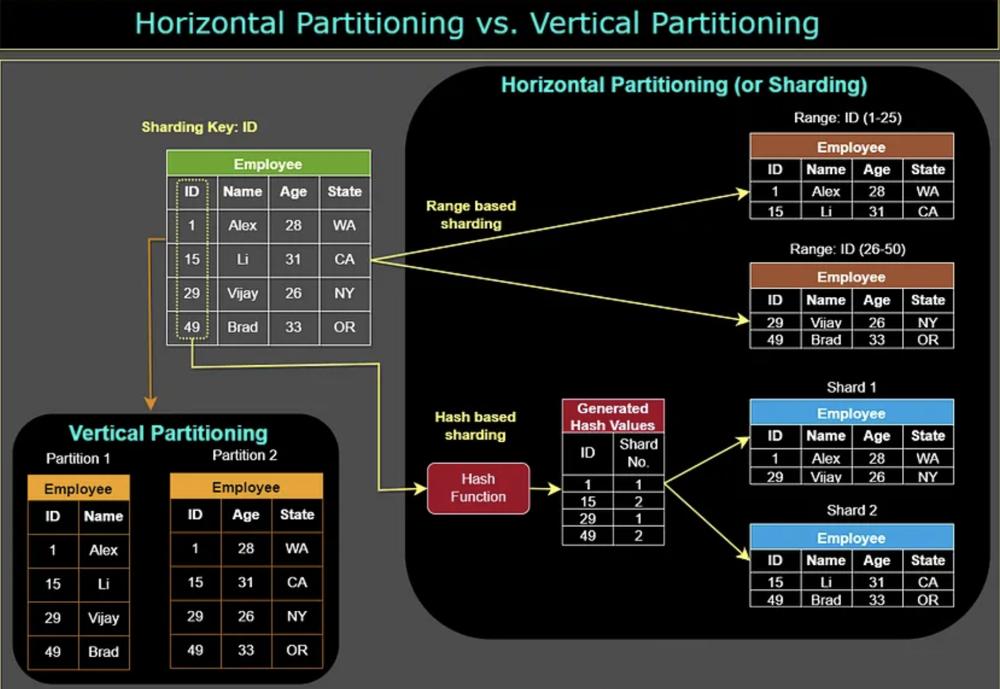

# Data Partitioning

# Horizontal Paritioning or Sharding
Horizontal partitioning, also known as **sharding**, involves dividing the rows of a table into smaller tables and storing them on different servers or database instances. This is done to distribute the load of a database across multiple servers and to improve performance.

# Vertical Partitioning

Vertical partitioning, involves dividing the columns of a table into separate tables. This is done to reduce the number of columns in a table and to improve the performance of queries that only access a small number of columns.

