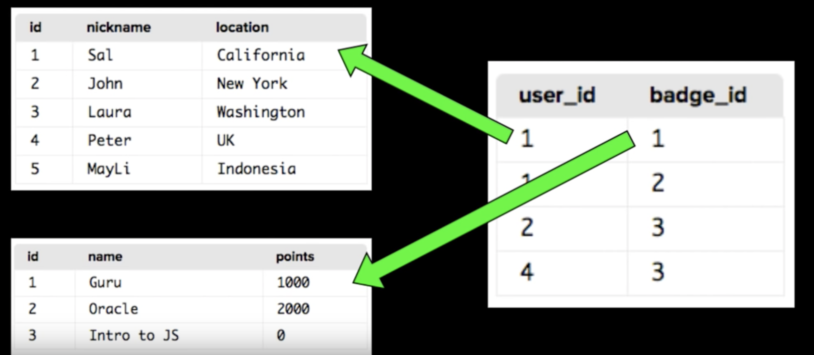
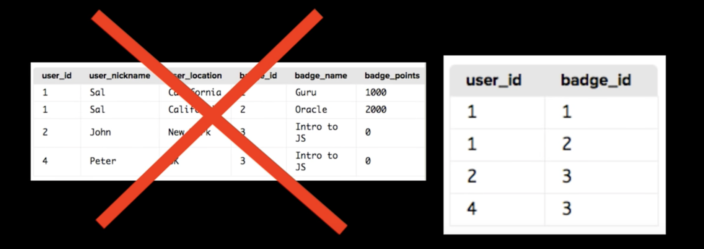

# Welcome to SQL

In today's world, Data is everywhere. All the apps and websites have tons of data to store and manage. So how do they do it? Well, all these data are stored as a program called **database**, that helps to store data and provides functionality for adding, modifying and querying those data. All these functionalities has to be done faster. Database is available in many forms and one of the most popular form is **relational database.**&#x20;

**Relational Database:**

It stores all kinds of data in a table more like a spreadsheet with each row indicating one item and each column representing one of the characteristics of that item. We don't need all properties of each item for every query/operation. So multiple tables are created and their relationships are stored.&#x20;

Most databases comes with a query language to interact with the database. SQL is designed entierly for accessing databases and it is one of the most popular query language. With SQL we can create table, change data and get data we need

### SEQUEL or SQL? How to prononuce?

SQL was first developed by IBM in 1970 and the first version they called as SEQUEL (Structured English QUEry Language) but since one of the airlines was using that name and to avoid lawsuits they changed it to SQL (Structured Query Language). So basically both are same.

