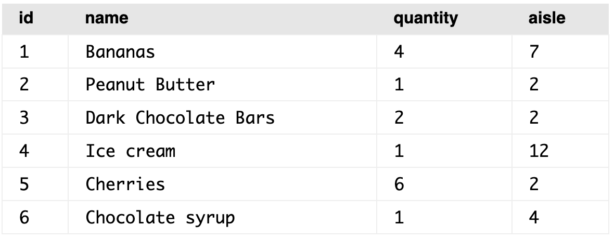
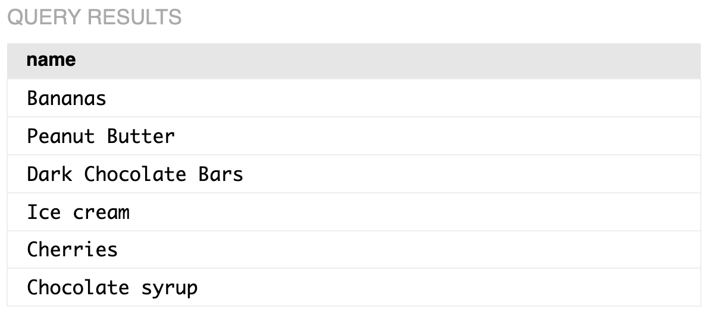
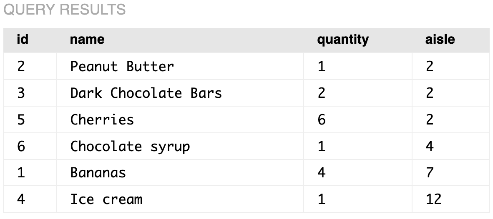
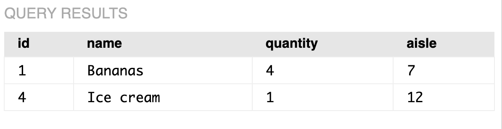
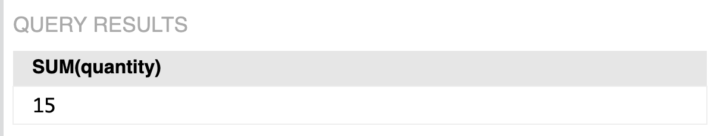
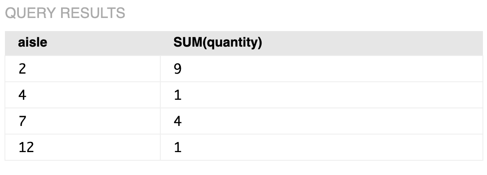

# Introduction to SQL

### Creating a Table and Inserting Data

We are going to create a grocery list with following data

```
/** Grocery List :
Rice 5kg (2)
Toor dal 1kg (2)
Dark Chocolate Bars (4)
**/
```

First we need to create the table where our data will be stored. Note: We always need to unique identifier to each item so that we can refer them as our database grows, we cannot depend on other columns because their data will change.

```sql
CREATE TABLE groceries (id INTEGER PRIMARY KEY, name TEXT, quantity INTEGER);
```

INTEGER PRIMARY KEY => informs that this is unique identifier generated for each item in the database and it is the key for the table.

Now, the table has been created, we need to insert data into our table

```sql
INSERT INTO groceries VALUES(1, "Rice 5Kg", 2);
INSERT INTO groceries VALUES(2, "Toor dal 1kg", 2);
INSERT INTO groceries VALUES(3, "Dark Chocolate Bars", 4); 
```

### Querying the Table

Lets consider the following table is present, and how to do certain query on the database

```sql
CREATE TABLE groceries (id INTEGER PRIMARY KEY, name TEXT, quantity INTEGER, aisle INTEGER);
INSERT INTO groceries VALUES (1, "Bananas", 4, 7);
INSERT INTO groceries VALUES(2, "Peanut Butter", 1, 2);
INSERT INTO groceries VALUES(3, "Dark Chocolate Bars", 2, 2);
INSERT INTO groceries VALUES(4, "Ice cream", 1, 12);
INSERT INTO groceries VALUES(5, "Cherries", 6, 2);
INSERT INTO groceries VALUES(6, "Chocolate syrup", 1, 4);
```



#### Querying for one entire column in a database

```sql
SELECT name FROM groceries
```



#### Query to get all columns from the table

```sql
SELECT * FROM groceries
```


#### To Display contents of the table sorted by specific column

```sql
SELECT * FROM groceries ORDER BY aisle
```



#### To Display contents of table sorted by specific column with certain condition

```sql
SELECT * FROM groceries WHERE aisle > 5 ORDER BY aisle;
```



### Aggregating Data

An aggregate function is used to get maximum, minimum, sum, average of values in our database. So lets say we need to find the total quantity we need to buy in our grocery list, we can use following query

```sql
SELECT SUM(quantity) FROM groceries;
```



If we need to know which item has more quantity to buy, we can use below query

```sql
SELECT MAX(quantity) FROM groceries; // Gives the item with maximum quantity
```

If we need to find the total quantity at the end of each Aisle, then we can make use of "**group by"** as below

```sql
SELECT aisle, SUM(quantity) FROM groceries GROUP BY aisle;
```



The SQL engine first did the grouping based on the aisle, then summed up quantities in each of this group and then it selected the first aisle value in each group (aisle value will be same for all items in the group). We could have also used name, in that case first item's name in that group could have displayed but that won't be proper result because we may have items with different names in each aisle. So it makes sense to display aisle name when we group by aisle. **Note: Don't display other columns than the one you used for grouping, so that we won't get misleading information.**

****
