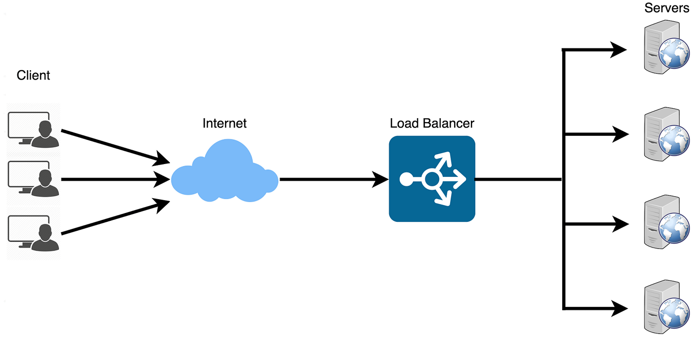

- [Load Balancer](#load-balancer)
  - [Load Balancing Algorithms](#load-balancing-algorithms)

# Load Balancer

A load balancer is a networking device or software that distributes incoming network traffic across multiple servers to ensure optimal resource utilization, reduce latency, and maintain high availability. 

It plays a vital role in scaling applications and managing server workloads efficiently, especially in situations where there is a sudden spike in traffic or uneven distribution of requests among servers.

## Load Balancing Algorithms

Load balancers use different algorithms to determine how to distribute incoming traffic. Common algorithms include:

1. **Round Robin**: Requests are distributed sequentially and evenly across all available servers in a cyclical manner.
2. **Least Connections**: The load balancer assigns requests to the server with the fewest active connections, prioritizing less-busy servers.
3. **IP Hash**: The client’s IP address is hashed, and the resulting value is used to determine which server the request should be directed to. This method ensures that a specific client’s requests are always routed to the same server, helping maintain session persistence.

