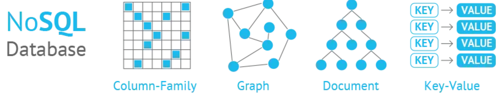

- [NoSQL Databases](#nosql-databases)
  - [NoSQL Categories](#nosql-categories)

# NoSQL Databases

NoSQL databases, or *Not Only SQL* databases, are **non-relational databases** designed to store, manage, and retrieve **unstructured or semi-structured data**. They offer an alternative to traditional relational databases, which rely on structured data and predefined schemas. NoSQL databases have become popular due to their flexibility, scalability, and ability to handle large volumes of data, making them well-suited for modern applications, big data processing, and real-time analytics.

## NoSQL Categories

NoSQL databases can be categorized into four main types:

1. **Document-Based**: These databases store data in document-like structures, such as JSON or BSON. Each document is self-contained and can have its own unique structure, making them *suitable for handling heterogeneous data*. Examples of document-based NoSQL databases include *MongoDB* and *Couchbase*.
2. **Key-Value**: These databases store data as key-value pairs, where the key acts as a unique identifier, and the value holds the associated data. Key-value databases are *highly efficient for simple read and write operations*, and they can be easily partitioned and scaled horizontally. Examples of key-value NoSQL databases include *Redis* and *Amazon DynamoDB*.
3. **Column-Family**: These databases store data in column families, which are groups of related columns. They are designed to handle *write-heavy workloads* and are *highly efficient for querying data with a known row and column keys*. Examples of column-family NoSQL databases include *Apache Cassandra* and *HBase*.
4. **Graph-Based**: These databases are designed for storing and querying *data that has complex relationships and interconnected structures*, such as social networks or recommendation systems. Graph databases use nodes, edges, and properties to represent and store data, making it easier to perform complex traversals and relationship-based queries. Examples of graph-based NoSQL databases include *Neo4j* and *Amazon Neptune*.
