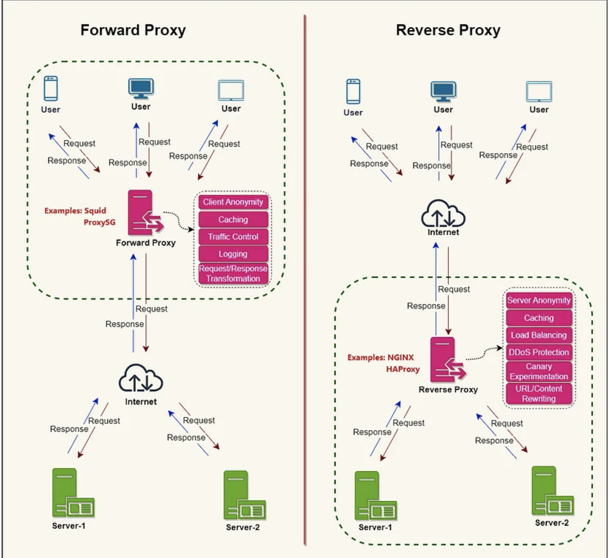

- [Forward Proxy](#forward-proxy)
- [Reverse Proxy](#reverse-proxy)

# Forward Proxy

A forward proxy, also known as a “proxy server,” or simply “proxy,” is a server that sits in front of one or more client machines and acts as an intermediary between the clients and the internet.

When a client machine makes a request to a resource on the internet, the request is first sent to the forward proxy. The forward proxy then forwards the request to the internet on behalf of the client machine and returns the response to the client machine.

# Reverse Proxy

A reverse proxy is a server that sits in front of one or more web servers and acts as an intermediary between the web servers and the Internet. When a client makes a request to a resource on the internet, the request is first sent to the reverse proxy. The reverse proxy then forwards the request to one of the web servers, which returns the response to the reverse proxy. The reverse proxy then returns the response to the client.

